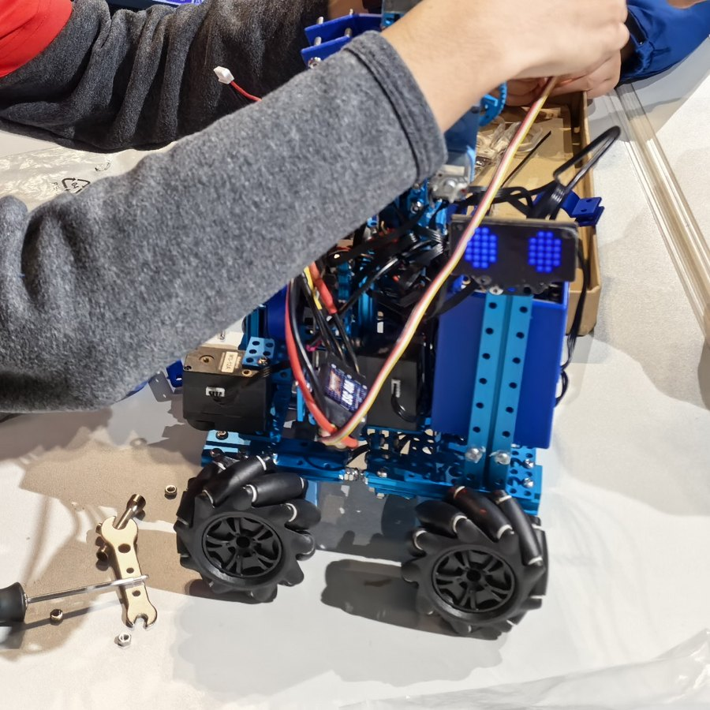

# 电子装置项目资料

本仓库保存电子装置项目的程序文件、开发日志、现场照片和比赛资料。下面的说明按原始文件整理；团队成员的逐项分工和各功能的独立作者尚未核实。



*图：从本仓库已有的[现场照片](图片/微信图片_20260124173203_61_302.jpg)裁切出的工作台细节，能看到机器人和调试过程。照片不能单独证明某个程序文件驱动了图中的机器人，也不能据此确定操作人的个人分工。*

## 建议的阅读顺序

先看[逐日开发日志](电子装置日志.log)，了解路线调整、模拟赛和赛后故障分析；再看下方的工程文件。这里保留了真实的试错过程，不把尚未验证的构想写成完成成果。

## 团队与资料

原有 README 列出的团队成员：莫欣睿、黄语萱、魏嘉谊。

| 路径 | 当前内容 |
| --- | --- |
| `M5_program/Competition.m5f2` | M5 项目文件 |
| `mblock_program/main.mblock`、`mblock_program/master.mblock` | mBlock 项目文件 |
| `电子装置日志.log` | 2025-12-26 至 2026-01-24 的逐日开发记录 |
| `图片/` | 三张赛场和调试现场照片；上方展示的是其中一张的裁切 |
| `赛规/` | 比赛规则及名单 PDF |

日志记录了遥控模块、底盘、夹爪、升降装置、涵道风扇等方面的开发与调试，也记录了未验证的控制逻辑及赛后故障分析。日志末条写“赛事止步16强”；仓库没有获奖证书，本项目不应作为获奖经历展示。

## 查阅与待核对

`.m5f2` 和 `.mblock` 文件需使用相应编辑工具查看；仓库没有提供可直接运行的 Python 入口或完整的硬件接线说明。若用于履历，宜结合项目文件、开发日志和现场照片呈现过程，并先核对个人分工、照片使用许可及比赛结果的正式证明。

`电子装置日志.log` 中一处队友姓名写作“黄雨萱”，与仓库原 README 所列“黄语萱”不一致，引用前需向团队确认。

## 📅 电子装置项目日志 (2025-12-26 至 2026-01-24)

```log
2025-12-26: 完成遥控模块开发，编码功能前期工作闭环
2025-12-27: 添加小车前部挡板；集成"绝对方向控制"逻辑（未验证）
2025-12-27: 赛场实地考察，评估场地环境与布局
2025-12-29: 确认最终技术路线；拆除实验机型，启动硬件拼装
2025-12-30: 分离小车前后段，开发悬挂系统结构
2026-01-02: 与黄语萱合作完成夹抓机构基础设计
2026-01-03: 启动涵道风扇初步设计
2026-01-04: 设计升降装置；指导魏嘉谊入门Onshape 3D建模
2026-01-05: 升级升降装置；完成涵道风扇支架与主板外壳设计
2026-01-08: 完成小车整体设计；优化风扇位置与夹爪布局
2026-01-09: 研发横向路径摆位算法；搭建训练平台原型
2026-01-10: 测试40A涵道风扇；设备成功打包进运输箱
2026-01-11: 现场测试小车，动力与控制表现达标
2026-01-12: 赛场观察其他组别（未发现对手）；升降装置实现无级调节
2026-01-13: 设计升降平台风扇支架；进行操作手感优化
2026-01-14: 新主板到货；定制M5主板方案集成大功率涵道风扇
2026-01-15: 整理并清点比赛所需零部件
2026-01-16: 修复传动轴断裂问题；讨论横向路径摆位优化方案
2026-01-17: 观摩初中组赛事，收集战术参考
2026-01-20: 完成涵道风扇核心研发（含散热与动力匹配）
2026-01-21: 完成涵道风扇电池底座开发；成功安装风扇支架
2026-01-22: 优化夹抓机构机械结构与响应速度
2026-01-23: 进行3场模拟赛对抗；完成赛前设备收尾
2026-01-24: 赛事止步16强；根因分析：升降杆结构强度不足导致卡顿
```

